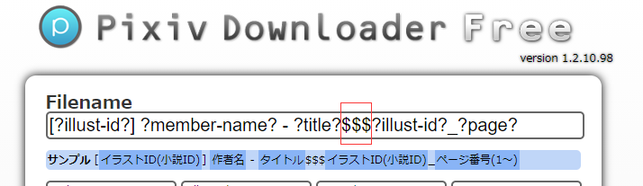
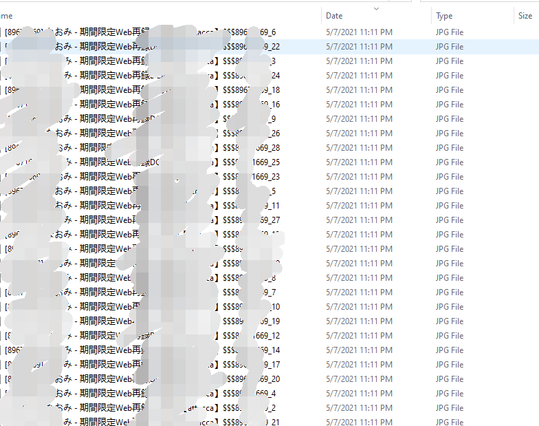
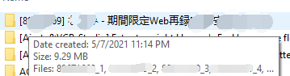

# Use with Pixiv Downloader

----

可以配合Chrome浏览器插件[Pixiv Downloader](https://chrome.google.com/webstore/detail/pixiv-downloader/fnbkeopcpjainobjebddfcnnknmfipid)使用，批量下载并整理多张来自于Pixiv的图片。


## 使用方法

### 1. 插件设置

在[Pixiv Downloader插件设置页面](chrome-extension://fnbkeopcpjainobjebddfcnnknmfipid/options.html)中，设置文件名格式。





文件名格式举例：
```
[?illust-id?] ?member-name? - ?title?$$$?illust-id?_?page?
```

注意保留`$$$`部分。脚本运行后，`$$$`之前的部分会成为子路径名，`$$$`之后的部分会成为新路径内的文件名。


### 2. 下载图片


在Pixiv作品页面，点击`Download`按键。


### 3. 运行脚本


将[pimg_organizer.bat](https://github.com/zephyruszzz/pixiv-download-organizer/blob/master/pimg_organizer.bat)下载至与图片存储路径相同的文件夹，双击运行。

整理前：



整理后：



